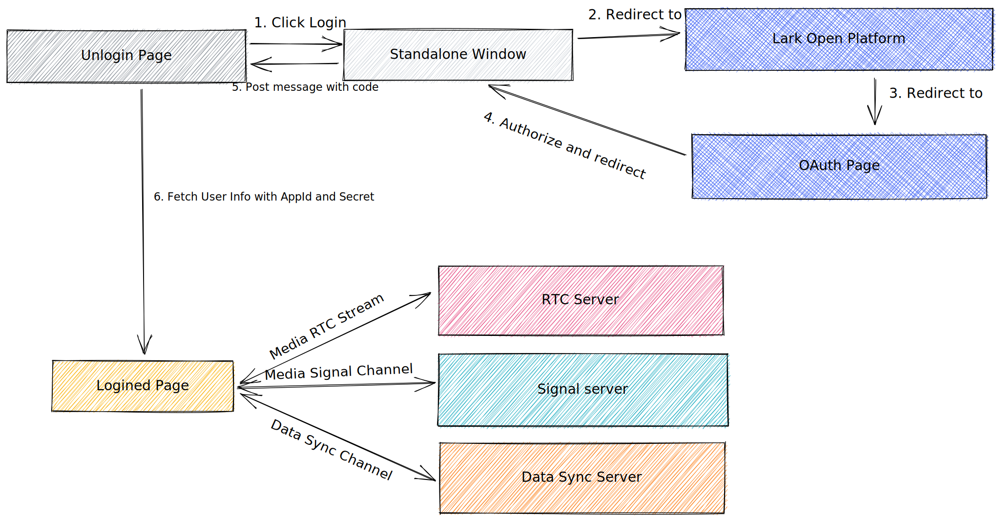

# 虚拟办公室 Meta Office

**ByteTech 1024 Hackathon**

> 本来是想集成到飞书工作台中，都已经把免登陆什么的都做好了，结果发现飞书的 webview 只是表面上支持 webrtc，底层并没有试图去获取设备信息。只能重写登录逻辑改为网页形式 QAQ

## 基本概念

- 房间: 每个房间都拥有独立的空间，存储用户位置信息，放置元件信息以及 RTC 链接隔离
- RTC: Real Time Communication 实时音视频，基于 `webrtc` + `mediasoup` 实现实时音视频通讯，基于 `socket.io` 实现信令服务
- 元件: 放置在房间中的多媒体链接标签，可以用于存放内容以及协作

[图片]

## 功能列表

- 自由移动(鼠标/方向键)
- RTC 实时通讯
  - 发言高亮
  - 音频通讯
    - 基于位置信息智能调整声音大小
  - 视频通讯
  - 控制器
  - ~~采样阈值~~
  - ~~戴耳机(自闭模式)~~
    - ~~拍一拍~~
- 飞书登陆
- 文本消息
  - 输入任意键唤醒消息输入框
- 多房间切换
- 信息分享(放置元件节点)
  - 点击元件展示预览

## 整体架构



## 部署手册

- 在飞书官网申请飞书第三方应用，获取到产品私钥
- 创建服务端环境变量: (如下)

  ```bash
  # server/.env
  FEISHU_HOST=https://open.feishu.cn # 飞书开放平台地址，如果为私有化部署或者国际平台需要修改修改
  APP_ID= # 飞书第三方应用id
  APP_SECRET= # 飞书第三方应用秘钥

  # web/.env
  ENDPOINT=https://localhost.com:3000 # 服务端地址
  TAILCHAT_MEETING_URL=wss://meeting.example.com # RTC服务地址(自部署的tailchat-meeting)
  ```

- 执行 pnpm install && pnpm dev 即可
- 根据终端提示打开网页
